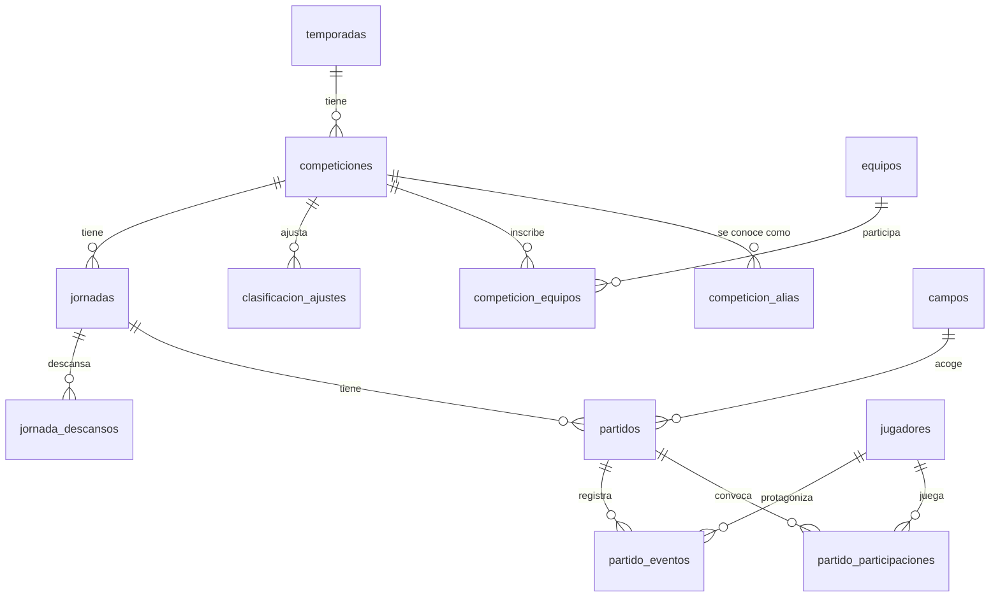

# Santiso Studio — reconstrucción local-first

- **Fecha:** 13/09/2026
- **Código de referencia:** `7a6c94f` (rama `refactor/herramienta-interna`)
- **Estado:** decisiones clave aprobadas por el propietario (ver §4). Fase 1 con plan ejecutable en [`../plans/2026-09-13-fase-1-fundacion-datos.md`](../plans/2026-09-13-fase-1-fundacion-datos.md). Las fases 2–7 se detallan en su propio plan al empezarlas.
- **Entradas:** exploración completa del repositorio, volcado del esquema y los datos reales de Supabase (solo lectura), pruebas técnicas (spikes) de Drizzle + libSQL en Windows, investigación de Futgal y precios de Gemini, y la [auditoría UX/UI del 13/09/2026](../../audits/2026-09-13-ux-ui.md).

---

## 1. Contexto

UD Santiso usa esta aplicación Next.js como herramienta personal para:

- generar carteles para redes sociales (7 plantillas en canvas),
- mantener calendario, resultados, equipos, plantilla y patrocinadores,
- importar actas y jornadas de la federación (hoy con Gemini y OCR local),
- llevar estadísticas de jugadores.

**No se despliega.** Se ejecuta en local y la usa una sola persona. En el futuro habrá una web pública del equipo que consumirá estos datos.

Hoy depende de Supabase (Postgres, Auth, Storage, RLS). Para una herramienta local y monousuario eso añade complejidad sin beneficio: login, políticas RLS, pausas del plan gratuito, dependencia de red y 27 MB de imágenes en la nube.

## 2. Objetivos

1. **Sin Supabase.** Datos en SQLite local y media en disco, con copias de seguridad simples.
2. **Código profesional.** Tipado de extremo a extremo, capas claras, pruebas automáticas, sin `any`, sin componentes de 1.800 líneas y con validación en los bordes.
3. **Datos íntegros.** Restricciones en la BD (FK, CHECK, únicos), escrituras atómicas y ninguna pérdida en la migración (verificada).
4. **UX corregida.** Incorporar los hallazgos de la auditoría UX/UI en la reconstrucción.
5. **Preparada para la web.** Esquema y lógica de dominio en paquetes reutilizables.

### No objetivos

- Multiusuario, autenticación o despliegue de la herramienta.
- Construir la web pública (queda preparada, no hecha).
- App de escritorio (Tauri/Electron).
- Descarga automática de datos de futgal.es (ver §7).

## 3. Diagnóstico del estado actual

### 3.1 Código

| Métrica | Valor |
| --- | --- |
| Líneas versionadas (sin lockfile) | ~23.500 |
| Componentes más grandes | `AdminJornadas` 1.804 · `AdminActaImporter` 1.337 · `AdminJornadaImporter` 1.108 · `AdminActaBatch` 869 · `AdminEquipos` 780 · `AdminPlayers` 726 |
| `app/globals.css` | 1.702 líneas |
| Accesos directos a Supabase desde el navegador | ~120 llamadas en 22 ficheros de la app |
| `any` explícitos | 49 |
| Estilos inline `style={{…}}` | 599 |
| Ficheros con `styled-jsx` | 10 (bloquean React Compiler, ver `next.config.ts`) |
| ESLint | 103 problemas (52 errores, 51 avisos) |
| `tsc --noEmit` | limpio |
| Pruebas automáticas | 0 |

Problemas estructurales:

- **Sin capa de datos.** Cada componente consulta y escribe en Supabase con su propio manejo de errores. Hay lógica duplicada: fuzzy matching repetido en tres ficheros y carga del catálogo de competiciones en cuatro.
- **Escrituras no atómicas.** `saveReviewedActa` borra estadísticas y eventos antes de guardar; si falla a mitad, se pierden datos. Varias acciones anuncian éxito sin comprobar errores (auditoría P1 #3 y #4).
- **Estado en memoria como navegación.** `app/admin/page.tsx` monta y desmonta vistas con `useState`: recargar pierde el contexto y `categoria` mezcla la categoría deportiva con secciones de plantilla (auditoría P1 #1 y #5).
- **Datos de respaldo estáticos** (`lib/data/season-2026-2027.ts`) con ids falsos que se mezclan con los reales.
- **Dependencias pesadas** en cliente: `tesseract.js`, `heic2any` y `browser-image-compression`.
- **Fechas.** `timestamptz` tratado como texto literal de hora local. Funciona por convención, pero es frágil.

### 3.2 Datos (volcado del 13/09/2026)

| Tabla | Filas | Notas |
| --- | ---: | --- |
| temporadas | 2 | "25/26" y "2026/27": formatos distintos |
| competiciones | 8 | cada una tiene jornadas de **una sola** temporada |
| competicion_etiquetas | 19 | alias de nombres |
| reglas_liga | 4 | JSON `{id,nombre,puestos,color}` |
| equipos | 67 | 2 duplicados por mayúsculas; 37 con clasificación manual en `pts/pj/…` |
| equipo_competiciones | 81 | un equipo Senior inscrito en competición de Veteranos |
| campos_futbol | 64 | sin duplicados |
| jornadas | 148 | `fecha_inicio` siempre a medianoche → es una fecha |
| jornada_equipo_descanso | 30 | coherente |
| partidos_liga | 688 | 56 «programado» con 0–0 por defecto; `categoria` y `competicion_id` redundantes con la jornada (0 incoherencias) |
| jugadores | 61 | |
| jugador_partido_stats | 1.211 | `goles` coincide al 100 % con los eventos; `minutos` siempre null; `convocado` siempre true |
| partido_eventos_santiso | 901 | 5 con minuto 999 («final»); `marcador_*`, `descripcion` y `fuente` vacíos o constantes |
| staff_club | 11 | |
| patrocinadores | 1 | los logos de carteles están aparte, en `cartel_assets` |
| cartel_assets | 8 | 2 logos institucionales, 5 patrocinadores y 1 fila de configuración camuflada |
| Storage `fotos` | 115 ficheros · 26,9 MB | 110 referenciados + escudo del club + 4 huérfanos |

Hay además tablas y vistas vacías de la antigua web pública (`shop_*`, `club_pages`, `public_posts`, `web_settings`, `noticias`, `estadisticas_partido_santiso`, vistas `public_*`) y dos RPC sin uso. **No se migran.**

## 4. Decisiones de arquitectura

Las decisiones marcadas con ✅ las eligió el propietario el 13/09/2026. El resto son recomendaciones técnicas justificadas.

### D1 ✅ Monorepo pnpm desde ya

```
apps/studio          herramienta (Next.js)
packages/domain      reglas de negocio puras, sin E/S
packages/db          esquema, migraciones, cliente y consultas
packages/cartel      motor de carteles en canvas (Fase 4)
tools/migracion-supabase   migración única de datos
```

pnpm workspaces sin Turborepo: con 4–5 paquetes no hace falta. Las versiones compartidas se fijan con `catalog:`. Los paquetes internos no se compilan: `exports` apunta a `src/*.ts` y Next los transpila (`transpilePackages`). La futura web importará `@santiso/db` y `@santiso/domain` sin copiar código.

### D2 Next.js 16 se mantiene

| Alternativa | Por qué no |
| --- | --- |
| Astro | Pensado para sitios de contenido. La herramienta es muy interactiva (editores, canvas en vivo, flujos de revisión). **Sí es la opción recomendada para la futura web pública.** |
| Vite + React Router 7 | Ganancia marginal; obligaría a construir una API y reescribir el enrutado. |
| Tauri / Electron | Empaquetar como app de escritorio no aporta nada frente a `pnpm dev` en local. |

Server Components y Server Actions dan acceso tipado a SQLite sin escribir una API, y reutilizan los componentes React y el motor de canvas. Es un Next con cambios importantes: se consulta siempre `node_modules/next/dist/docs/`.

### D3 SQLite con libSQL y Drizzle ORM

- **Driver:** `@libsql/client` 0.18. Binarios precompilados para Windows (sin compilar nada), API asíncrona y compatible con Turso si algún día la web necesita datos en vivo. Descartados: `better-sqlite3` (nativo y síncrono), `node:sqlite` (experimental) y Postgres local (servicio extra).
- **ORM:** Drizzle 0.45.2 + drizzle-kit 0.31.10. Esquema en TypeScript, migraciones SQL versionadas y tipos inferidos. Se usa **solo el query builder core** (sin `db.query` relacional) para que pasar a Drizzle 1.0 (hoy RC) sea trivial.
- **Verificado en spike (Windows, Node 22.23):** migraciones generadas y aplicadas, CHECK con nombre, índice único parcial, PK compuesta, cascadas y `restrict`, JSON, `$onUpdateFn`, WAL, `VACUUM INTO`, rutas absolutas `file:C:/…` y tipado estricto (`noUncheckedIndexedAccess`, `verbatimModuleSyntax`).
- **Limitación verificada:** `close()` de libSQL no libera el fichero hasta que termina el proceso (`EBUSY` al renombrar o borrar). Por eso las operaciones que mueven ficheros de BD corren en un proceso hijo y la app debe estar parada al importar o restaurar.

### D4 Media en disco

- Ficheros en `data/media/<clave>`. La BD guarda la **clave relativa** (`escudos/<uuid>.webp`), nunca una URL absoluta.
- Se sirven con un route handler `app/media/[...clave]/route.ts`: tipo MIME, `Cache-Control: immutable` (nombres únicos) y protección contra `..`.
- Procesado **en servidor** con `sharp`: recorte de transparencia, lienzo cuadrado, 1.200 px y WebP. El cliente solo convierte HEIC→JPEG con `heic2any` (el `sharp` precompilado no decodifica HEVC). Se elimina `browser-image-compression`.

### D5 Sin autenticación

Se eliminan login, proxy de sesión, RLS y variables de Supabase. Los servidores de desarrollo y producción escuchan **solo en `127.0.0.1`**: las Server Actions admiten POST directos y no deben quedar expuestas a la red local.

### D6 Capa de datos del servidor

- Lecturas en Server Components llamando a funciones de consulta (`server-only`).
- Mutaciones con Server Actions por sección, entrada validada con Zod y salida `Resultado<T>`:

```ts
type Resultado<T> =
  | { ok: true; datos: T }
  | { ok: false; error: string; campos?: Record<string, string> };
```

- Toda operación que toca varias tablas va en **una transacción**: guardar acta, activar temporada, importar jornada, fusionar equipos.
- Tras mutar, `refresh()` o `revalidatePath` según la guía local de Next.
- La conexión es un singleton del proceso; la ruta de datos llega por `SANTISO_DATA_DIR`.

### D7 Dominio puro en `packages/domain`

Contiene categorías, catálogos, fechas literales, nombres normalizados, similitud de nombres, temporadas y ajustes; en fases posteriores, clasificación y estadísticas. Sin E/S, isomórfico (sirve en navegador y servidor) y con cobertura completa de pruebas unitarias.

### D8 Motor de carteles en `packages/cartel` (Fase 4)

Canvas 2D sin dependencias del DOM salvo el contexto: la carga de imágenes se inyecta. Así se prueba sin navegador con `@napi-rs/canvas` y sirve en servidor si hiciera falta. Las fuentes (Outfit y Nunito, licencia OFL) pasan a ser locales y dejan de cargarse desde Google Fonts, de modo que funciona sin red.

### D9 Estilos: CSS Modules y tokens

Tokens CSS (ya existen como variables) y CSS Modules por componente, sin librería de estilos en tiempo de ejecución. Eliminar `styled-jsx` y los estilos inline permite activar **React Compiler** (`reactCompiler: true`). Los componentes base propios y accesibles siguen la auditoría: `<dialog>` nativo con gestión de foco y toasts con `aria-live`.

### D10 Navegación por URL

Una ruta por sección (App Router) y el contexto (`temporada`, `categoria`, `competicion`, plantilla de cartel) en `searchParams`. Recargar, ir atrás y compartir conservan la ubicación. La categoría deportiva deja de mezclarse con las secciones de plantilla.

### D11 ✅ Importación federativa sin OCR local

Se elimina Tesseract. Estrategia en §7: parser determinista de los documentos oficiales descargados a mano e IA solo como respaldo para capturas.

### D12 ✅ Clasificación calculada con ajustes

La clasificación siempre se calcula desde los partidos. La tabla `clasificacion_ajustes` (puntos ± con motivo, por competición y equipo) cubre sanciones y decisiones federativas. Los datos manuales antiguos (`equipos.pts/pj/…`) se guardan en el informe de migración solo para validar el cálculo y después se descartan.

### D13 Calidad y herramientas

| Área | Elección |
| --- | --- |
| Lenguaje | TypeScript 5.9.3 `strict` + `noUncheckedIndexedAccess` + `verbatimModuleSyntax`. **No TS 7**: el plugin de Next depende de la API JS del compilador. |
| Pruebas | Vitest 4.1 (dominio, BD en memoria, transformaciones, acciones) + Playwright (e2e de la app) |
| Lint / formato | ESLint 9 (`typescript-eslint` en paquetes, `eslint-config-next` en la app) + Prettier 3 |
| Validación | Zod 4 en todos los bordes: acciones, snapshot, respuestas de IA y JSON de BD |
| Código muerto | knip (Fase 7) |
| Puerta de calidad | `pnpm check` = typecheck + lint + formato + test |

### D14 Datos y copias

- `data/` (BD, media, snapshots, copias e informes) **nunca** entra en git: contiene datos personales.
- `pnpm db:backup` hace `VACUUM INTO` con marca de tiempo (válido con la app en marcha). En la Fase 2 se amplía a media.
- Recomendación: sincronizar `data/backups` con una carpeta en la nube.

## 5. Arquitectura objetivo

### 5.1 Estructura

```
santiso/
├─ apps/
│  └─ studio/                  Next.js (UI + Server Actions)
│     ├─ app/                  rutas por sección, route handler de media
│     ├─ src/server/           conexión, consultas y acciones (server-only)
│     ├─ src/ui/               componentes base + CSS Modules
│     └─ src/secciones/        componentes por sección
├─ packages/
│  ├─ domain/                  lógica pura + Zod
│  ├─ db/                      esquema Drizzle, migraciones, cliente, copias
│  └─ cartel/                  motor canvas + textos de Instagram (Fase 4)
├─ tools/
│  └─ migracion-supabase/      exportar → transformar → importar → verificar
├─ data/                       (ignorado) santiso.db, media/, snapshots/, backups/, informes/
└─ docs/                       specs, planes, auditorías
```

### 5.2 Reglas de dependencia

```
domain  ←  db  ←  studio
   ↑        ↑
   └── cartel (solo domain)      tools → db, domain
```

- `domain` no importa nada del repositorio.
- `db` no conoce la UI.
- `studio` solo accede a `db` desde `src/server` (con `import "server-only"`).
- Los componentes cliente reciben datos serializables o llaman a acciones.

### 5.3 Flujo de una mutación

```
Formulario (cliente) → acción "use server" → Zod → transacción Drizzle → Resultado<T>
                                                          ↓
                                            refresh() / revalidatePath
```

## 6. Modelo de datos

### 6.1 Relaciones



Tablas independientes: `staff`, `patrocinadores`, `ajustes`.

### 6.2 Cambios frente al esquema actual

| Antes (Supabase) | Después (SQLite) | Motivo |
| --- | --- | --- |
| `competiciones.activa` global; `jornadas.temporada_id` | `competiciones.temporada_id` | Jerarquía real temporada → competición → jornada; la temporada activa determina lo vigente |
| `categoria`/`competicion_id` repetidos en jornadas, partidos, relaciones y reglas | Solo en `competiciones` | Eliminar redundancia (0 incoherencias hoy, pero posibles) |
| `reglas_liga` (tabla) | `competiciones.reglas_clasificacion` (JSON validado) | Relación 1:1 |
| `competicion_etiquetas` | `competicion_alias` con `clave` normalizada | Búsqueda en importaciones |
| `equipos.pts/pj/pg/pe/pp/gf/gc` | `clasificacion_ajustes` | D12 |
| `equipos.nombre` sin unicidad | `equipos.clave` + único `(categoria, clave)`; `es_propio` | Evita los duplicados reales; identifica al club sin buscar «santiso» en el nombre |
| `partidos_liga.goles_*` 0 por defecto | null = sin disputar; CHECK de marcador completo | Distinguir «—» de 0–0 (auditoría §6) |
| `fecha` timestamptz leído como texto | `TEXT 'YYYY-MM-DDTHH:mm'` hora de pared | Explícito |
| `jugador_partido_stats.goles/minutos/convocado` | `partido_participaciones (titular, jugo)`; goles derivados de eventos | Una sola fuente de verdad |
| `partido_eventos_santiso.es_rival` + `nombre_mostrado` (propias codificadas con cadenas mágicas) | `lado` (`propio`/`rival`) + `propia` + `jugador_id`/`jugador_sale_id`/`nombre_rival`; minuto null en vez de 999 | Semántica explícita y verificable con CHECK |
| `staff_club.tipo` "Tecnico"/"Directiva" | `staff.tipo` `tecnico`/`directiva`, CHECK de categoría según tipo, `orden` | Coherencia |
| `patrocinadores` + logos en `cartel_assets` | `patrocinadores.en_carteles` + `orden` | Una sola fuente (auditoría §5) |
| Fila `config/logo_order` en `cartel_assets`; escudo en ruta fija de Storage | `ajustes` clave→JSON validado (`club.escudo`, `cartel.logo_xunta`, `cartel.logo_rfgf`, `cartel.orden_logos`) | Configuración tipada |
| URLs absolutas de Storage | Claves relativas de media | D4 |
| Nombres de tabla mezclados (`partidos_liga`, `campos_futbol`, `staff_club`…) | `partidos`, `campos`, `staff`, `partido_eventos`… | Nombres limpios para la futura web |

Todas las tablas usan id UUID en texto (se conservan los de Supabase), `creado_en` y `actualizado_en` ISO UTC, enumerados con CHECK y FKs con `cascade` solo en relaciones de composición (`restrict` en el resto).

### 6.3 Reglas de migración de datos

La migración es un proceso **repetible y determinista** (misma entrada → mismos ids y filas): exportar → transformar → importar → verificar. Cualquier dato que exija una decisión humana **detiene** el proceso con un mensaje claro (`ErrorMigracion`). Las correcciones automáticas quedan registradas en un informe.

| # | Regla |
| --- | --- |
| R1 | Nombres de temporada normalizados a `AAAA/AA` («25/26» → «2025/26»). Exactamente una activa. |
| R2 | Temporada de cada competición = la de sus jornadas (debe ser única). Sin jornadas: activa → temporada activa; inactiva → última temporada inactiva (con aviso). |
| R3 | Reglas de clasificación validadas con Zod; deben pertenecer a la misma temporada. |
| R4 | Alias deduplicados por `(competición, clave)`. |
| R5 | Equipos con misma `(categoria, clave)` se fusionan: se conserva el más antiguo con el primer escudo disponible y se remapean todas las referencias. |
| R6 | Equipo usado en una competición de otra categoría: se busca o crea (id determinista) el equipo homónimo de esa categoría y se remapean las referencias de esa competición. |
| R7 | Equipos que juegan en una competición sin estar inscritos se inscriben (aviso). |
| R8 | Partidos: la competición debe coincidir con la de la jornada. `programado`/`aplazado`/`cancelado` con 0–0 → sin marcador (aviso); con otro marcador → error. `finalizado` sin marcador → error. |
| R9 | Fechas: `fecha` → `YYYY-MM-DDTHH:mm`; `fecha_inicio`/`fecha_fin` → `YYYY-MM-DD`; `created_at` → ISO UTC. |
| R10 | Participaciones desde estadísticas (`titular` implica `jugo`). Los goles de las estadísticas deben coincidir con los eventos o se detiene. |
| R11 | Jugador con eventos sin participación → se crea (`jugo`) y se contabiliza. |
| R12 | Eventos: correspondencia exhaustiva de las 7 formas conocidas (gol propio, gol en propia de rival, gol en propia nuestro, gol rival, tarjeta propia, tarjeta rival, cambio). Minuto 999 → null. Cualquier otra forma → error. |
| R13 | Staff: tipo normalizado; directiva sin categoría (aviso si la tenía); `orden` por antigüedad. |
| R14 | Patrocinadores: los existentes (`en_carteles = false`) más los logos de carteles (`en_carteles = true`, orden original), fusionando por clave. |
| R15 | Ajustes: escudo del club, logos institucionales y orden de logos. |
| R16 | Media: solo ficheros referenciados más el escudo del club, con verificación SHA-256. |
| R17 | Clasificación manual antigua → informe (no se importa). |

## 7. Importación de datos federativos: investigación y estrategia

### 7.1 Hallazgos (13/09/2026)

- **No hay API pública oficial** de la RFGF/Futgal. La app oficial (Novanet) usa servicios privados.
- Las **fichas de partido de futgal.es son públicas**: `NFG_CmpPartido?cod_primaria=…&CodActa=…`, con una cookie de sesión anónima. Traen en HTML servido desde el servidor titulares y suplentes con dorsal, goles con marcador acumulado y minuto, tarjetas, sustituciones por pares, campo, ciudad, jornada, fecha y árbitros. La página ofrece «Generar PDF».
- **`robots.txt` de futgal.es prohíbe los bots** (`User-agent: * Disallow: /`). Una herramienta que descargue fichas automáticamente iría contra esa política. **Descartado.**
- **Gemini** (precios oficiales, pago por uso, 1M tokens entrada/salida): `gemini-2.5-flash-lite` $0,10/$0,40 · `gemini-3.1-flash-lite` $0,25/$1,50 · `gemini-3.5-flash-lite` $0,30/$2,50 · `gemini-3.5-flash` (el que se usa hoy) $1,50/$9,00. Todos tienen capa gratuita.
- Cada página de PDF cuesta 258 tokens. En Gemini 3, **el texto nativo del PDF no se cobra**.
- Con ~2 páginas y ~3.000 tokens de contexto (plantilla + campos), un acta cuesta **menos de 0,002 $** con flash-lite. El coste no es el problema: lo es la **exactitud**.

### 7.2 Estrategia (Fase 5)

1. **Vía principal, determinista y sin coste:** el usuario descarga desde su navegador el PDF oficial («Generar PDF») o guarda la ficha HTML. La app extrae el texto (`unpdf`/pdf.js, o el DOM del HTML guardado) y lo analiza con un parser por secciones y por equipo, probado con actas reales como fixtures. Resultado exacto: sin alucinaciones ni nombres mal leídos.
   - *Validación al empezar la fase:* comprobar con 3–5 actas reales que el PDF tiene capa de texto. Si no la tiene, el HTML guardado es la vía principal.
2. **Respaldo con IA para capturas o fotos:** `@google/genai` con `responseJsonSchema` generado desde Zod (`z.toJSONSchema`). Modelo por defecto `gemini-3.1-flash-lite` y escalado a `gemini-3.5-flash` solo si falla la validación. Clave solo en servidor. Interfaz de proveedor intercambiable.
3. **Mismo flujo para todo:** Subir → Revisar destino y cambios → Confirmar. Nunca se guarda sin aprobación explícita (auditoría P1 #6).

## 8. Hoja de ruta

Cada fase deja software funcionando y verificable. Orden por valor y dependencias.

### Fase 1 — Fundación y datos ▶ [plan detallado](../plans/2026-09-13-fase-1-fundacion-datos.md)

- **Objetivo:** monorepo, herramientas de calidad, paquetes `domain` y `db`, y datos reales migrados y verificados en SQLite.
- **Alcance:**
  - Mover la app a `apps/studio` sin cambiar su comportamiento.
  - Catálogo de versiones, TypeScript, Vitest, ESLint y Prettier.
  - Dominio base con pruebas.
  - Esquema completo con migración inicial y pruebas de restricciones.
  - CLI de migrar y copia.
  - Herramienta de migración con informe.
- **Aceptación:**
  - `pnpm check` en verde.
  - `pnpm migracion:importar` produce `data/santiso.db` con informe correcto y `pnpm migracion:verificar` sin fallos.
  - La app sigue funcionando contra Supabase (`pnpm build` y `pnpm dev`).
- **Riesgo:** los datos divergen si se editan en la app antes de la Fase 2. **Mitigación:** repetir exportar e importar justo antes del corte (proceso determinista).

### Fase 2 — Corte de Supabase

> **Actualización 15/09/2026:** la fase se divide en tres planes, cada uno con software funcionando:
> - **2A — Infraestructura de servidor** ([plan](../plans/2026-09-15-fase-2a-infraestructura-servidor.md)): Next 16.3, `127.0.0.1`, conexión y `Resultado<T>`, media local con `sharp`, arreglos R14/R15, e2e y capturas de referencia. No reconecta pantallas.
> - **2B — Reconexión de secciones:** consultas y acciones por sección sobre SQLite, DTOs de compatibilidad y guardado atómico de actas. Empieza con una reimportación desde Supabase y, desde ese momento, no se edita en Supabase.
> - **2C — Retirada de Supabase:** login, proxy, dependencias, variables y datos estáticos; verificación final contra las capturas de referencia.
>
> El código de servidor vive en `apps/studio/lib/server/` (estructura existente de la app) en lugar de `src/server/`.

- **Objetivo:** la app lee y escribe solo en SQLite y media local; desaparecen Supabase y el login.
- **Alcance:**
  - Actualizar Next 16.3 y React 19.3 (guía local de actualización).
  - `apps/studio/src/server/`: conexión, consultas y acciones por sección con `Resultado<T>`.
  - **DTOs de compatibilidad temporales** con la forma que esperan los componentes actuales. Se marcan como obsoletos y se eliminan en las fases 4–6.
  - Sustituir las ~120 llamadas `supabase.*`.
  - Route handler de media y subida con `sharp`.
  - Guardado de acta en una transacción.
  - Eliminar login, `proxy.ts`, `lib/supabase*`, `@supabase/*`, `images.remotePatterns`, datos estáticos de temporada, `legacy/supabase/` y variables de entorno de Supabase.
  - Servidor en `127.0.0.1`.
  - `db:backup` incluye media.
  - Capturas de referencia de todas las pestañas y carteles **antes** del corte (`shoot-admin.ts`, `render-cartel.ts`).
- **Aceptación:**
  - `rg -i supabase apps packages` sin resultados.
  - Pruebas de integración de acciones sobre BD en memoria.
  - Playwright de humo: cada sección carga y hace una lectura y una escritura.
  - Carteles visualmente idénticos a las capturas de referencia.
- **Auditoría cubierta:** P1 #3 (atomicidad), P1 #4 (errores comprobados), P2 login `/escudo.png` (desaparece).

### Fase 3 — Sistema de diseño, shell y navegación

- **Objetivo:** base visual y de interacción común, accesible y responsive.
- **Alcance:**
  - Tokens y CSS Modules.
  - Fuera `styled-jsx` y estilos inline del shell; React Compiler activado.
  - Fuentes locales con `next/font/local`.
  - Componentes base: Button, Field (label asociado), Select, Textarea, Dialog, ConfirmDialog, Toast, DataTable, Tabs/Segmented, PageHeader, estados vacío/carga/error.
  - Rutas por sección y contexto en URL.
  - Menú agrupado según la auditoría (Competición, Plantilla, Producción, Catálogos, Ajustes).
  - Guardia de cambios sin guardar.
  - `prefers-reduced-motion`.
- **Aceptación:**
  - Recargar, ir atrás y compartir conservan vista y contexto.
  - Cambiar a Directiva no altera la categoría deportiva.
  - Diálogos con foco atrapado, Escape y retorno del foco.
  - Sin scroll horizontal de página a 360 y 390 px.
  - axe sin violaciones críticas en el shell.
- **Auditoría cubierta:** P1 #1, P1 #5 (parte común), P2 #7 (acceso a Ajustes), P2 #8 y «Navegación y sistema visual».

### Fase 4 — Carteles

- **Objetivo:** motor en paquete probado y editor rediseñado.
- **Alcance:**
  - `packages/cartel`: plantillas, primitivas, textos de Instagram y `renderizarCartel(ctx, plantilla, datos, recursos)`.
  - Pruebas de renderizado sin navegador con `@napi-rs/canvas` para las 7 plantillas.
  - Editor con secciones «Contenido · Diseño · Exportar».
  - Selector de partido con búsqueda y resumen antes de aplicar.
  - Borradores por plantilla en BD (`cartel_borradores`).
  - Estados «Cargando / Faltan datos / Listo» antes de exportar; nombre de archivo legible; formato real (sin prometer transparencia).
  - Próximos con 1–3 partidos sin relleno.
  - O Noso 11 con duplicados y capitán.
  - Cronoloxía con descuento (`minuto_extra`, nueva migración).
  - Multiusos con aviso de desbordamiento.
  - Clasificación con origen de datos visible.
  - Clasificación calculada en `domain` (desempates actuales + ajustes).
- **Aceptación:**
  - Criterios de la auditoría §7–§7.7.
  - Pruebas de renderizado en verde.
  - Paridad visual con las referencias de la Fase 2 salvo cambios aprobados.

### Fase 5 — Importadores de actas y jornadas

- **Objetivo:** importación exacta, revisable y atómica (§7.2).
- **Alcance:**
  - Validación inicial del formato de PDF y HTML con actas reales.
  - Parser determinista con fixtures.
  - Respaldo IA con salida estructurada.
  - Emparejado con `claveNombre`, alias y umbrales explícitos.
  - Individual: pasos Archivo → Partido → Revisar → Guardar, con resumen de reemplazo.
  - Lote: analiza sin escribir, tabla de estados y filtros, resolución manual del partido, «Guardar N revisadas», reintento por fila.
  - Jornada: filas Nuevo/Actualización/Conflicto/Descanso; guarda descansos; errores por fila.
  - Eliminar Tesseract, `futgal-parser` OCR y endpoints duplicados.
- **Aceptación:**
  - Auditoría §8, §8.1 y §9.
  - Ningún guardado sin confirmación.
  - Fallo parcial identificado por fila sin perder lo correcto.
  - Pruebas del parser con actas reales.

### Fase 6 — Secciones de gestión y clasificación

- **Objetivo:** reescribir las pantallas de datos sobre la base de las fases 2–3 y retirar los DTOs de compatibilidad.
- **Alcance:**
  - Ajustes › Competición: temporadas con activación atómica, competiciones por temporada, reglas y alias.
  - Calendario: barra de contexto, navegación entre jornadas, lista compacta, editor desplegable, «—» frente a 0–0, validaciones actuales conservadas.
  - Clasificación: vista calculada y editor de ajustes, validada contra la clasificación manual del informe de migración.
  - Equipos: lista con búsqueda, homónimos con categoría y competiciones, «Quitar de competición» frente a «Eliminar».
  - Plantilla: jugadores, técnicos y directiva con edición completa, historial por filas, aviso de dorsal repetido y vista previa de foto.
  - Patrocinadores unificados.
  - Ajustes › Club y Ajustes › Carteles.
- **Aceptación:**
  - Criterios de la auditoría §1–§6 y «Ajustes».
  - e2e CRUD por sección.
  - Clasificación 2025/26 igual a la manual salvo diferencias explicadas por ajustes.

### Fase 7 — Estadísticas y preparación de la web

- **Objetivo:** estadísticas de jugadores (propósito central) y datos listos para la web.
- **Alcance:**
  - Vista por temporada, competición y categoría: convocatorias, titularidades, partidos jugados, goles y tarjetas.
  - Ficha de jugador con partidos.
  - Exportar CSV.
  - Cartel «Goleadores» si se aprueba.
  - `pnpm exportar:web`: copia pública de solo lectura (sin fechas de nacimiento ni datos privados) más media optimizada.
  - Guía para una web Astro estática.
  - Limpieza con knip; README, AGENTS.md y ADRs actualizados.
- **Aceptación:**
  - Estadísticas cuadran con eventos y participaciones (pruebas).
  - Exportación reproducible y sin datos personales sensibles.

## 9. Integración de la auditoría UX/UI

La auditoría es válida como **entrada de producto**, pero **no debe ejecutarse sobre el código actual**:

- Casi todos los hallazgos apuntan a ficheros que se reescriben en las fases 2–6.
- El paso a monorepo cambia todas las rutas.
- Varios puntos quedan obsoletos por las decisiones: login, recuperación de contraseña, cierre de sesión y `/escudo.png`.
- Los riesgos de datos P1 se resuelven por arquitectura: transacciones y `Resultado<T>`.

El plan que enlaza la auditoría (`plans/2026-09-13-ux-ui.md`) no existe y no debe crearse aparte.

| Hallazgo | Fase |
| --- | --- |
| P1 #1 Contexto inválido entre pestañas | 3 |
| P1 #2 Calendario móvil recortado | 3 (shell) + 6 (pantalla) |
| P1 #3 Pérdida al reimportar actas | 2 (transacción) + 5 (resumen de reemplazo) |
| P1 #4 Éxito sin verificar respuestas | 2 |
| P1 #5 Trabajo sin guardar | 3 (guardia) + 4/6 (formularios) |
| P1 #6 Lote guarda automáticamente | 5 |
| P2 #7 Ajustes de carteles ocultos | 3 + 6 |
| P2 #8 Modal sin aislamiento de teclado | 3 |
| §1–§6 Pestañas de gestión | 6 |
| §5 Patrocinadores frente a `cartel_assets` | 1 (esquema) + 6 (UI) |
| §7 Carteles | 4 |
| §8–§9 Actas y jornada | 5 |
| Acceso / login | Obsoleto (D5) |
| Ajustes transversales | 3 + 6 |
| Navegación y sistema visual | 3 |

## 10. Estrategia de pruebas

| Nivel | Herramienta | Qué cubre | Desde |
| --- | --- | --- | --- |
| Unitarias | Vitest | `domain`, transformaciones de migración, parsers, textos de Instagram | F1 |
| Integración BD | Vitest + libSQL `:memory:` con migraciones reales | Restricciones, consultas, acciones y transacciones | F1 |
| Renderizado | Vitest + `@napi-rs/canvas` | 7 plantillas de cartel | F4 |
| E2E | Playwright | Humo por sección, flujos de importación con fixtures, CRUD | F2 |
| Accesibilidad | axe (Playwright) | Shell, diálogos, formularios | F3 |

Reglas:

- TDD en dominio, transformaciones y parsers.
- Ningún dato real en fixtures versionadas (anonimizar nombres).
- `pnpm check` antes de cada commit.

## 11. Riesgos y mitigaciones

| Riesgo | Mitigación |
| --- | --- |
| Datos editados en Supabase tras exportar | Migración repetible; exportar e importar justo antes del corte (F2) |
| Bloqueo de ficheros libSQL en Windows | Operaciones de fichero en proceso hijo; parar `pnpm dev` al importar o restaurar |
| Pérdida del disco local | `pnpm db:backup` + carpeta de copias sincronizada con la nube |
| Next 16 con APIs cambiantes | Guías locales en `node_modules/next/dist/docs/` antes de cada fase |
| Drizzle 1.0 | Solo query builder core; actualización aislada en `packages/db` |
| Futgal cambia el formato | Pruebas del parser con fixtures + respaldo IA |
| Regresiones visuales en carteles | Capturas de referencia (F2) + pruebas de renderizado (F4) |
| Alcance excesivo | Fases independientes con criterios de aceptación; cada una tiene su plan |

## 12. Convenciones

- **Idioma:** dominio en español (tablas, columnas, funciones de negocio, textos de UI); términos técnicos en inglés cuando son estándar (`client`, `schema`, `testing`). Los carteles mantienen su idioma (gallego).
- **Nombres:** columnas `snake_case`, propiedades TS `camelCase`, componentes `PascalCase.tsx`, módulos `kebab-case.ts` o palabra única.
- **Tipos:** sin `any`; `unknown` + Zod en los bordes; `as` solo con comentario que lo justifique.
- **Errores:** acciones con `Resultado<T>`; `ErrorMigracion` en herramientas; nunca silenciar un `catch`.
- **Commits:** Conventional Commits en español (`feat(db): …`), uno por tarea del plan.
- **Secretos:** solo en `apps/studio/.env.local`; nunca en logs, snapshots ni informes.

## 13. Futuro (fuera de alcance)

- **Web pública:** Astro estático que lee la exportación de la Fase 7 durante el build. Si necesita datos en vivo: Turso con el mismo esquema libSQL.
- **Integración continua** en GitHub Actions ejecutando `pnpm check`.
- **Recalcular desde el acta:** marcador y estadísticas derivados de los eventos al guardar un acta.
